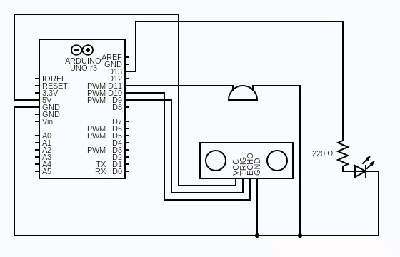
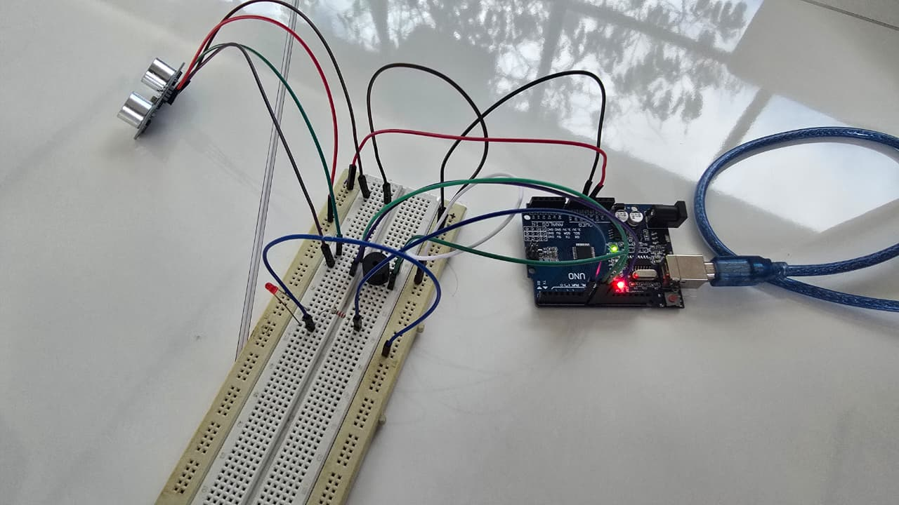
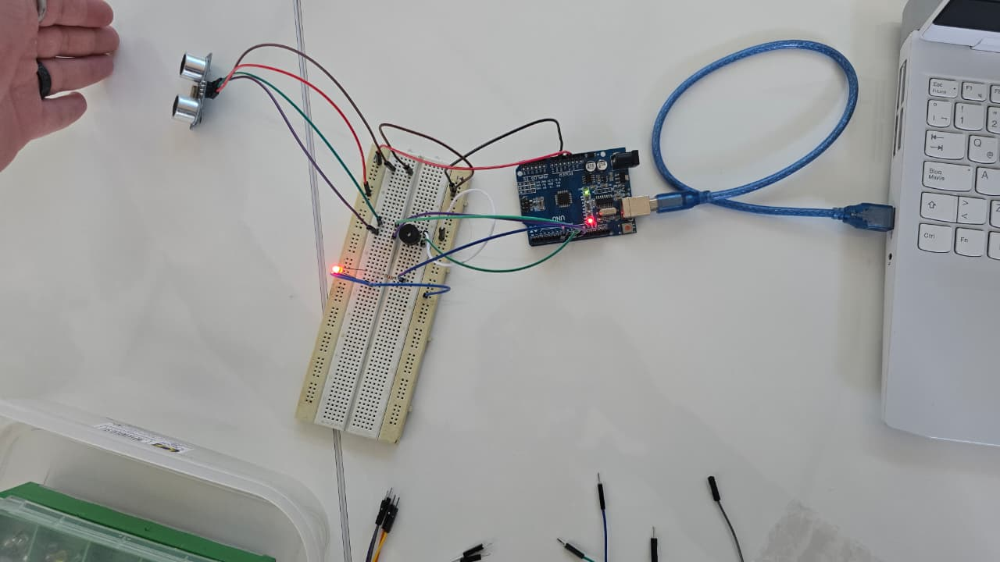

# Sistema Embebido de Alarma de Sueño para Conductores o Estudiantes
 
Proyecto final de Circuitos Digitales basado en Arduino para la detección de posibles estados de somnolencia mediante un sensor ultrasónico y una alerta visual y acústica.
 
**Universidad de San Buenaventura · Ingeniería Multimedia**  
**Autores:** Kevin Beltrán, Juan Bejarano, Jesus García, Miguel Villanueva
 
---
 
## Descripción del proyecto
 
Este proyecto consiste en el desarrollo de un sistema embebido capaz de detectar cambios de distancia asociados a posibles estados de somnolencia en conductores o estudiantes.
 
El sistema utiliza un sensor ultrasónico **HC-SR04** para medir en tiempo real la distancia entre el usuario y el dispositivo. Cuando el usuario se inclina hacia adelante por fatiga —reduciendo la distancia frontal por debajo del umbral configurado— el sistema activa simultáneamente un **LED rojo** (alerta visual) y un **buzzer piezoeléctrico** (alerta sonora) para despertar al usuario.
 
El prototipo fue desarrollado con **Arduino Uno** y componentes electrónicos básicos, logrando una solución funcional, económica y de fácil replicación. El tiempo máximo de respuesta está acotado por diseño a **200 ms** (período de muestreo del firmware), garantizando una reacción prácticamente inmediata ante el evento de somnolencia.
 
---
 
## Problemática abordada
 
La fatiga y la somnolencia representan un riesgo crítico tanto en ambientes académicos como durante la conducción de vehículos.
 
**En estudiantes:**
- Disminuye la concentración y la retención de información.
- Afecta el rendimiento académico.
- Incrementa los errores por falta de atención sostenida.
**En conductores:**
- Reduce drásticamente la capacidad de reacción.
- Incrementa el riesgo de accidentes viales.
- Puede generar pérdida total del control del vehículo.
Los sistemas comerciales de monitoreo biométrico son costosos y de difícil acceso. Este proyecto propone una alternativa de **bajo costo** basada en sistemas embebidos, que detecta señales físicas de somnolencia (inclinación del torso o la cabeza) sin requerir sensores biométricos complejos.
 
---
 
## Componentes utilizados
 
| Componente | Cantidad |
|---|---|
| Arduino Uno (ATmega328P) | 1 |
| Sensor ultrasónico HC-SR04 | 1 |
| LED rojo de alta intensidad | 1 |
| Resistencia 220 Ω | 1 |
| Buzzer piezoeléctrico | 1 |
| Protoboard | 1 |
| Jumpers / cables Dupont | Varios |
| Cable USB tipo B | 1 |
 
---
 
## Diagrama de conexiones
 
| Componente | Pin componente | Pin Arduino Uno |
|---|---|---|
| Sensor HC-SR04 | VCC | 5V |
| Sensor HC-SR04 | GND | GND |
| Sensor HC-SR04 | TRIG | Pin 9 (salida) |
| Sensor HC-SR04 | ECHO | Pin 10 (entrada) |
| LED rojo | Ánodo (vía 220 Ω) | Pin 7 (salida) |
| LED rojo | Cátodo | GND |
| Buzzer piezoeléctrico | Terminal + | Pin 8 (salida) |
| Buzzer piezoeléctrico | Terminal − | GND |
 
<p align="center">
  
  <br/>
  <em>Diagrama esquemático electrónico de la arquitectura propuesta</em>
</p>
---
 
## Instrucciones de uso
 
### 1. Requisitos previos
 
- [Arduino IDE](https://www.arduino.cc/en/software) instalado (versión 1.8 o superior).
- Cable USB tipo B para conectar el Arduino al computador.
- Todos los componentes conectados según el diagrama anterior.
### 2. Instalación y carga del código
 
1. Clonar o descargar este repositorio:
   ```bash
   git clone https://github.com/usuario/nombre-del-repo.git
   ```
2. Abrir el archivo `codigo/alarma_sueno.ino` en el Arduino IDE.
3. En el menú **Herramientas**, seleccionar:
   - **Placa:** Arduino Uno
   - **Puerto:** el puerto COM o `/dev/ttyUSB` que corresponda al Arduino conectado.
4. Hacer clic en **Subir** (→) para cargar el firmware al Arduino.
### 3. Operación del sistema
 
1. Una vez cargado el firmware, el sistema entra en funcionamiento automáticamente.
2. Posicionar el sensor HC-SR04 orientado hacia el torso o la cabeza del usuario a una distancia inicial mayor a 20 cm.
3. El sistema opera en dos estados:
| Estado | Condición | LED rojo | Buzzer |
|---|---|---|---|
| **Reposo** | Distancia ≥ 20 cm | Apagado | Silencio |
| **Alerta** | Distancia < 20 cm | Encendido | Activo (1 kHz) |
 
4. Al detectar somnolencia (distancia < 20 cm), el LED rojo se enciende y el buzzer emite un tono continuo hasta que el usuario recupere la postura erguida.
5. Para monitorear las lecturas en tiempo real, abrir el **Monitor Serial** del Arduino IDE a **9600 baudios**.
### 4. Calibración del umbral
 
El umbral de detección está definido en el código como:
 
```cpp
if (distance < 20) { ... }
```
 
Para ajustarlo según la distancia real de instalación, modificar el valor `20` (en centímetros) en el archivo `.ino` y volver a cargar el firmware.
 
---
 
## Evidencia del circuito
 
<p align="center">
  
  &nbsp;&nbsp;
  
</p>
<p align="center"><em>Montaje físico del prototipo durante las pruebas de laboratorio</em></p>
---
 
 
## Limitaciones conocidas
 
- El sistema detecta somnolencia únicamente por **inclinación frontal**. Pérdidas de postura laterales o hacia atrás no son detectadas.
- El umbral de 20 cm es estático; no se adapta automáticamente a distintas distancias de instalación.
- El uso de protoboard puede introducir falsos contactos en entornos con vibración.
## Mejoras futuras
 
- Migrar el circuito a una **PCB** para mayor robustez mecánica.
- Implementar un **algoritmo de ventana de muestreo** que dispare la alerta tanto por acercamiento extremo como por ausencia prolongada del usuario.
- Agregar un **segundo sensor lateral** para cubrir los puntos ciegos de detección.
---
 
## Licencia
 
Este proyecto fue desarrollado con fines académicos en la Universidad de San Buenaventura.

